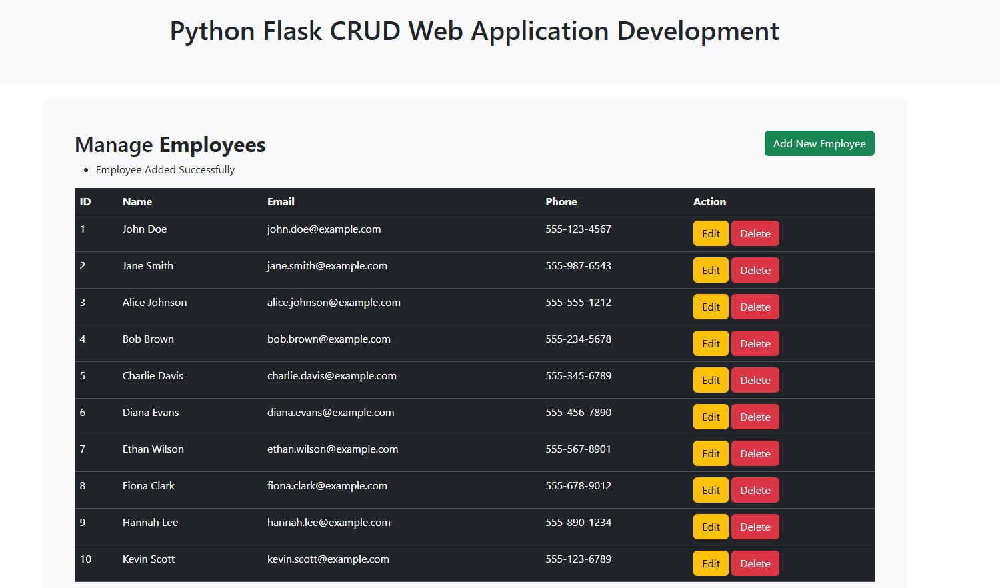
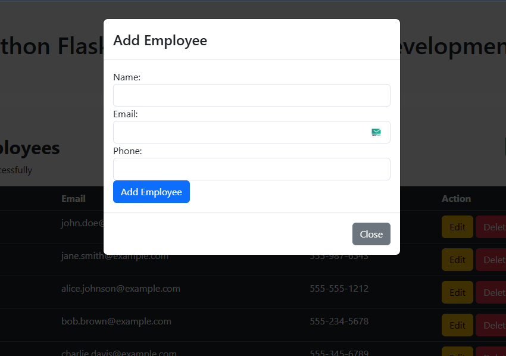
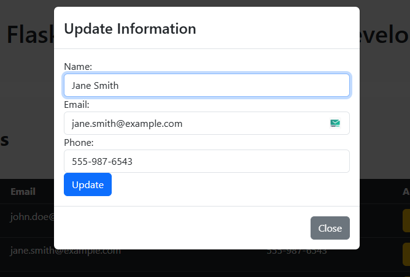
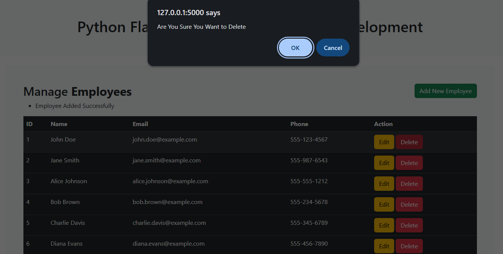
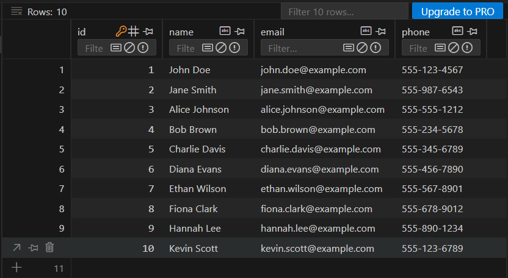

# 👨‍💼 Employee-Management-System – Flask CRUD Application
<p align="center">
  
  
  
  
  
  
</p>


The Employee Management System is a web-based application built with Flask that provides a simple yet effective way to manage employee records. It implements full CRUD (Create, Read, Update, Delete) functionality, allowing users to add new employees, view existing records, update details through modal forms, and remove records when necessary. The backend is powered by Flask and SQLAlchemy, with data stored in an SQLite database by default, making it lightweight and easy to set up. On the frontend, Bootstrap is used to deliver a responsive and user-friendly interface, including modals for seamless interactions and flash messages for feedback on user actions.

 <br>
 
---

## ✨ Features
- **Create** – Add new employees with name, email, and phone details.  
- **Read** – View all employees in a styled Bootstrap table.  
- **Update** – Edit employee details through modal forms.  
- **Delete** – Remove employees with confirmation prompts.  
- **Flash Messages** – User-friendly feedback for each action (add, update, delete).  
- **Database** – Uses SQLite by default.  

<br>

---

## 📊 Dataset Schema
The application uses an SQLite database (employees.db) located in the instance folder by default. <br>
The database consists of a single table: Info, which stores employee details.

|  Column    | Type      |   Description      |
|------|-------|---------|
|    id  |    Integer   |    Primary key, auto-incremented     |
|    name  |   String     |     Full name of the employee (max 200)    |
|    email   |   String   |    Email address of the employee (max 200)     |
|    phone   |  String    |     Contact number of the employee (max 200)    |

### Example Record:
| id | name     | email                                       | phone        |
| -- | -------- | ------------------------------------------- | ------------ |
| 1  | John Doe | [john@example.com](mailto:john@example.com) | 555-123-4567 |

<br>

---

## 🛠️ Tech Stack
- **Backend:** Flask (Python)  
- **Database:** SQLAlchemy ORM with SQLite  
- **Frontend:** HTML, Bootstrap, Jinja2 Templates  
- **Other:** Flask Flash for messages  

<br>

---

## 📂 Project Structure

```bash
Employee-Management-System/
│── app.py                # Main Flask application
│── /templates
│    ├── base.html        # Base layout
│    ├── header.html      # Header with title
│    ├── index.html       # Main CRUD interface
│── /static
│    ├── css/             # Bootstrap / custom CSS
│    ├── js/              # Bootstrap / custom JS
│── /instance
│    └── employees.db     # SQLite database file
│── README.md             # Documentation

```
<br>

---

## 🚀 Installation

```bash
# Clone repository
git clone https://github.com/your-username/Employee-Management-System.git 
  
# Install dependencies
pip install -r requirements.txt

# If employees.db is not already created, open Python shell and run:
from app import db
db.create_all()

# Run application
python app.py

The app will start on http://127.0.0.1:8050.
```
<br>


⭐ Feel free to contribute, fork, or open issues to improve this project.

<br>

---

## 📸 Screenshots
<p align="center">
  <em>Main interface showing Employee id, name, email, phone, and Actions.</em>
</p>
<p align="center">
  
</p>

<br>

<p align="center">
  <em>Add a new Employee using the dedicated pop-up window with input fields.</em>
</p>
<p align="center">
  
</p>

<br>

<p align="center">
  <em>Update an existing Employee. Pre-filled fields make editing easy.</em>
</p>
<p align="center">
  
</p>

<br>

<p align="center">
  <em>Delete confirmation popup showing safe deletion with user confirmation.</em>
</p>
<p align="center">
  
</p>

<br>

<p align="center">
  <em>Basic layout of the database created, filled with employee information</em>
</p>

<p align="center">
  
</p>


